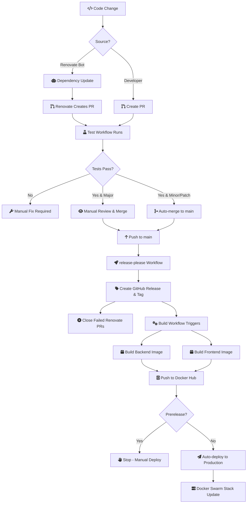

# ghcr-browser

Minimal web application to list GitHub Container Registry (GHCR) image tag names for a given `owner/image` and allow copying full `owner/image:tag` references. MVP intentionally excludes metadata enrichment (size, age, digest), pagination, truncation notices, rate‑limit distinction, retries, caching, and advanced accessibility beyond keyboard submission and copy action.

## What It Does
You enter a public GHCR image reference (`owner` and `image`). The app calls the backend which queries GHCR's tag list API (with an anonymous request and a follow‑up token attempt if required). It then displays all accessible tag names in a sortable/filterable grid. You can click a tag's full reference to copy `ghcr.io/owner/image:tag` to the clipboard.

Deliberately omitted in MVP: tag metadata (size, age, digest), pagination UI (backend keeps internally paging until exhaustion or safety cap), caching, retries/backoff, rate limit distinction, private repo auth UX, advanced accessibility refinements.

## Backend (C# .NET 8)
Location: `backend/`

### Run (dev)
Option A (simple):
```
dotnet run --project backend/src/GhcrBrowser.Api/GhcrBrowser.Api.csproj
```
Serves API at the URL shown (default http://localhost:5214).

Option B (watch):
```
dotnet watch --project backend/src/GhcrBrowser.Api/GhcrBrowser.Api.csproj run
```

Endpoints:
- `GET /api/health` → `{ "status": "ok", "uptimeSeconds": <int> }`
- `GET /api/openapi.yaml` → OpenAPI contract (static copy)
- `GET /api/images/{owner}/{image}/tags` → `{ "tags": ["v1", "latest", ...] }` (no pagination or metadata)

### Build Solution
```
dotnet build GhcrBrowser.sln
```

## Frontend (SvelteKit + Tailwind)
Location: `frontend/`

Install deps:
```
npm install --prefix frontend
```
Run dev (port 5173):
```
npm run dev --prefix frontend
```
Open http://localhost:5173

The frontend expects the backend under `/api/*`. When running both locally with defaults:
- Frontend: http://localhost:5173
- Backend:  http://localhost:5214

For CORS-less local dev you can (a) proxy, or (b) start the backend first then start frontend and configure a Vite proxy. Minimal MVP currently assumes same origin; easiest path is to run `npm run dev --prefix frontend` then separately run backend and access backend endpoints directly via the browser if needed.

## Development Quickstart
Typical flow:
1. Backend: `dotnet run --project backend/src/GhcrBrowser.Api/GhcrBrowser.Api.csproj`
2. Frontend: `npm run dev --prefix frontend`
3. In browser: enter `owner` and `image` (e.g. `stefanprodan` and `podinfo`) then click Search.
4. Click a full reference to copy it. Status line shows copies and counts.

See `specs/001-ghcr-browser-is/quickstart.md` for additional validation scenarios.

## Current Error Codes
- `InvalidFormat` — Input not matching `owner/image` rules.
- `NotFound` — Repository not found or has zero accessible tags (treated as not found if initial call empty).

## Future Enhancements (Deferred)
- Metadata enrichment: size, updated timestamp, age formatting, digest truncation & copy, source/Dockerfile links.
- Pagination (page size 100) and 500-tag truncation with notice.
- Rate limit vs transient error distinction and retry/backoff policy.
- Tag highlight when a tag component provided.
- Partial metadata placeholders and progressive loading.
- In-memory caching, request coalescing, performance instrumentation (latency logging, client render metrics).
- Accessibility refinements: focus management on errors, aria-live announcements, keyboard row navigation.
- Token redaction & authenticated private image support.

## Container (Docker Compose)

Quick start (production-style images: backend ASP.NET + static frontend via nginx):
```
docker compose up --build
```
Visit: http://localhost:5173

Services:
- Backend API: http://localhost:5214 (container port 8080) — `/api/*`
- Frontend UI: http://localhost:5173 (nginx serving static SvelteKit build + proxy /api)

Healthcheck: backend container exposes `/api/health` and compose waits for healthy before starting frontend.

Rebuild after code changes:
```
docker compose build backend    # only backend
# or
docker compose build            # all
```

Tear down:
```
docker compose down
```

Local dev (hot reload) still uses:
- Backend: `dotnet run --project backend/src/GhcrBrowser.Api/GhcrBrowser.Api.csproj`
- Frontend: `npm run dev --prefix frontend`

The production frontend image uses `@sveltejs/adapter-static` and nginx. To change proxy behavior edit `frontend/nginx.conf`. No Node runtime needed in production for the UI.

## CI/CD Pipeline

This project uses automated dependency management and continuous deployment:



### Workflows

1. **Test** (`.github/workflows/test.yml`)
   - Triggers on pull requests
   - Runs backend, frontend, and e2e tests
   - Required to pass before merge

2. **Renovate** (`.github/workflows/renovate.yml`)
   - Runs every 6 hours
   - Scans for dependency updates (npm, NuGet, Docker base images)
   - Creates PRs with conventional commits
   - Auto-merges minor/patch updates after tests pass
   - Logs activity to `RENOVATE.md`

3. **Release Please** (`.github/workflows/release-please.yml`)
   - Triggers on push to main
   - Analyzes conventional commits since last release
   - Creates GitHub release and git tag directly (no PR)
   - Auto-increments version (starting from v1.0.0)
   - Closes failed Renovate PRs when new updates merge

4. **Build** (`.github/workflows/build.yml`)
   - Triggers on GitHub release creation
   - Builds and pushes Docker images to Docker Hub
   - Tags: `latest`, `<release-tag>`, `sha-<commit>`
   - Auto-deploys to production (non-prerelease only)

### Version Management

- **Conventional Commits** determine version bumps:
  - `fix:` → patch (1.0.0 → 1.0.1)
  - `feat:` → minor (1.0.0 → 1.1.0)
  - `feat!:` or `BREAKING CHANGE:` → major (1.0.0 → 2.0.0)

- **Renovate PRs** use `fix(deps):` prefix → patch bumps

### Deployment

Production deployment uses Docker Swarm:
- Stack config: `deploy/docker-compose.yml`
- Network: `ghcr-browser-net` (external overlay)
- Images pulled from Docker Hub with registry auth

Manual deployment:
```bash
VERSION=v1.0.1 docker stack deploy --with-registry-auth -c deploy/docker-compose.yml ghcr-browser
```

## Contributing
Keep commits small and focused. For MVP, avoid reintroducing deferred features until explicitly scheduled.

Refer to `specs/001-ghcr-browser-is/tasks.md` for the active MVP task list.
